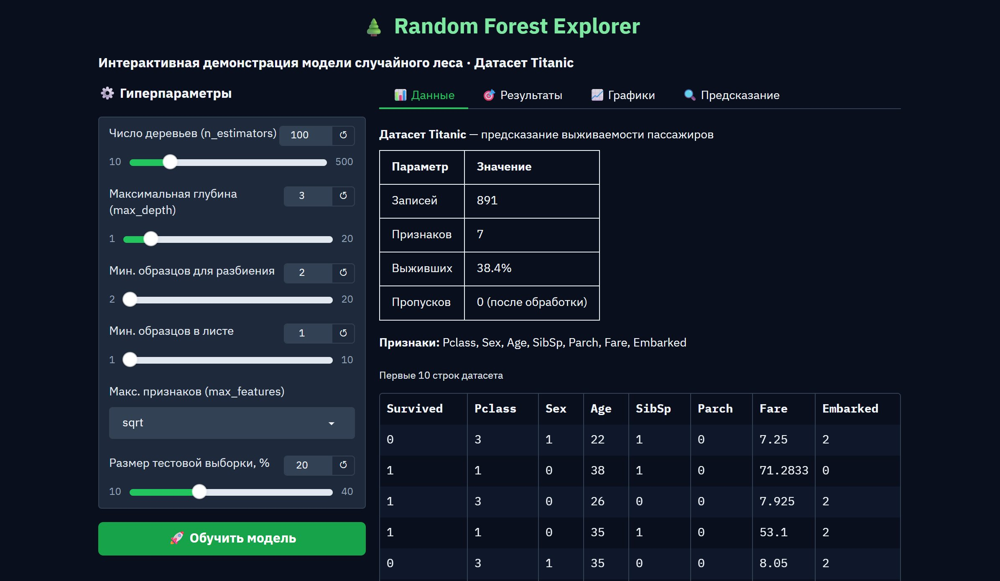
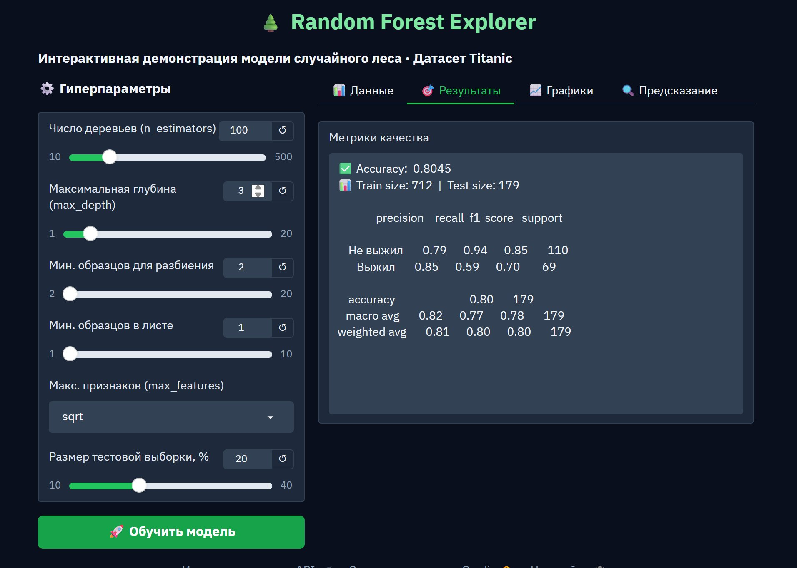
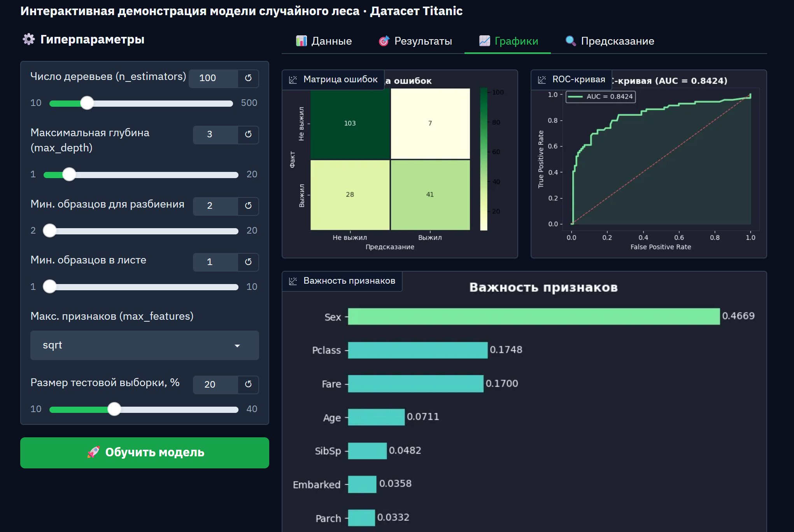
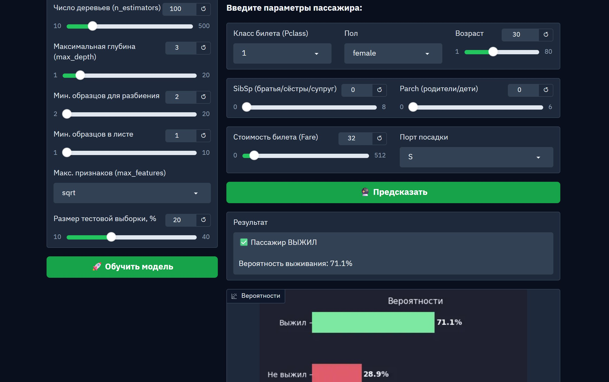

# Отчёт по лабораторной работе
## Создание веб-приложения для демонстрации моделей машинного обучения

---

## 1. Описание задания

**Цель:** разработать макет веб-приложения для анализа данных с использованием модели машинного обучения.

**Реализация:** веб-приложение на фреймворке **Gradio** для демонстрации модели **Random Forest** на датасете **Titanic**.

**Функциональность приложения:**

| Возможность | Реализация |
|---|---|
| Задание гиперпараметров | Панель со слайдерами и выпадающими списками |
| Обучение модели | Кнопка «Обучить модель» |
| Просмотр результатов | Метрики: Accuracy, Precision, Recall, F1 |
| Визуализация | Матрица ошибок, ROC-кривая, важность признаков |
| Предсказание | Вкладка с вводом параметров нового пассажира |

**Настраиваемые гиперпараметры:**

| Параметр | Диапазон | Значение по умолчанию |
|---|---|---|
| n_estimators | 10–500 | 100 |
| max_depth | 1–20 | 3 |
| min_samples_split | 2–20 | 2 |
| min_samples_leaf | 1–10 | 1 |
| max_features | sqrt, log2, None | sqrt |
| test_size | 10–40% | 20% |

**Установка и запуск:**
```bash
pip install gradio scikit-learn pandas numpy matplotlib seaborn
python gradio_app.py
```

---

## 2. Текст программы

```python
"""
Веб-приложение для демонстрации модели Random Forest
Датасет: Titanic (классификация выживаемости)
"""

import gradio as gr
import pandas as pd
import numpy as np
import matplotlib.pyplot as plt
import seaborn as sns
from sklearn.ensemble import RandomForestClassifier
from sklearn.model_selection import train_test_split
from sklearn.metrics import (accuracy_score, classification_report,
                             confusion_matrix, roc_curve, auc)
from sklearn.preprocessing import LabelEncoder

# Загрузка и предобработка данных
def load_data():
    url = ("https://raw.githubusercontent.com/datasciencedojo/"
           "datasets/master/titanic.csv")
    df = pd.read_csv(url)
    df.drop(columns=['PassengerId', 'Name', 'Ticket', 'Cabin'],
            inplace=True)
    df['Age'].fillna(df['Age'].median(), inplace=True)
    df['Embarked'].fillna(df['Embarked'].mode()[0], inplace=True)
    le = LabelEncoder()
    df['Sex']      = le.fit_transform(df['Sex'])
    df['Embarked'] = le.fit_transform(df['Embarked'])
    return df

df = load_data()
X = df.drop(columns=['Survived'])
y = df['Survived']

# Функция обучения — возвращает метрики и графики
def train_model(n_estimators, max_depth, min_samples_split,
                min_samples_leaf, max_features, test_size):
    X_train, X_test, y_train, y_test = train_test_split(
        X, y, test_size=test_size / 100, random_state=42, stratify=y
    )
    model = RandomForestClassifier(
        n_estimators=int(n_estimators),
        max_depth=int(max_depth),
        min_samples_split=int(min_samples_split),
        min_samples_leaf=int(min_samples_leaf),
        max_features=None if max_features == 'None' else max_features,
        random_state=42, n_jobs=-1
    )
    model.fit(X_train, y_train)
    y_pred  = model.predict(X_test)
    y_proba = model.predict_proba(X_test)[:, 1]

    acc    = accuracy_score(y_test, y_pred)
    report = classification_report(y_test, y_pred,
                                   target_names=['Не выжил', 'Выжил'])
    metrics_text = (f"Accuracy:  {acc:.4f}\n"
                    f"Train: {len(X_train)} | Test: {len(X_test)}\n\n"
                    f"{report}")
    # ... построение графиков матрицы ошибок, ROC, важности признаков
    return metrics_text, fig_cm, fig_roc, fig_fi

# Функция предсказания для нового пассажира
def predict_passenger(..., pclass, sex, age, sibsp, parch, fare, embarked):
    model = RandomForestClassifier(...).fit(X, y)
    input_data = pd.DataFrame([[pclass, sex_val, age, sibsp,
                                 parch, fare, embarked_val]],
                               columns=X.columns)
    pred  = model.predict(input_data)[0]
    proba = model.predict_proba(input_data)[0]
    # ... возвращает результат и график вероятностей

# Интерфейс Gradio
with gr.Blocks(title="Random Forest Explorer") as demo:
    # Слайдеры гиперпараметров + кнопка обучения
    # Вкладки: Данные, Результаты, Графики, Предсказание
    ...

demo.launch(share=True)
```

---

## 3. Экранные формы

### 3.1 Главная страница — вкладка «Данные»



Вкладка отображает описание датасета: 891 запись, 7 признаков, 38.4% выживших, 0 пропусков после обработки. Показаны первые 10 строк датасета в интерактивной таблице.

### 3.2 Вкладка «Результаты» после обучения



Параметры модели: `n_estimators=100`, `max_depth=3`, `max_features=sqrt`, `test_size=20%`.

```
Accuracy:  0.8045
Train size: 712  |  Test size: 179

              precision  recall  f1-score  support
Не выжил        0.79     0.94      0.85      110
Выжил           0.85     0.59      0.70       69

accuracy                           0.80      179
macro avg       0.82     0.77      0.78      179
weighted avg    0.81     0.80      0.80      179
```

### 3.3 Вкладка «Графики»



Отображаются три графика:

**Матрица ошибок:**
- Верно классифицировано «Не выжил»: 103
- Верно классифицировано «Выжил»: 41
- Ошибки первого рода: 7
- Ошибки второго рода: 28

**ROC-кривая:** AUC = 0.8424 — модель хорошо разделяет классы.

**Важность признаков:**
- Sex: 0.4669 (наиболее важный признак)
- Pclass: 0.1748
- Fare: 0.1700
- Age: 0.0711
- SibSp: 0.0482
- Embarked: 0.0358
- Parch: 0.0332

### 3.4 Вкладка «Предсказание»



Пример предсказания для пассажира: класс 1, пол female, возраст 30, SibSp=0, Parch=0, Fare=32, порт S.

```
Пассажир ВЫЖИЛ
Вероятность выживания: 71.1%

Выжил    ████████████████  71.1%
Не выжил ████████          28.9%
```

---

## 4. Выводы

1. Веб-приложение реализовано на фреймворке **Gradio** — позволяет создавать интерактивные дашборды на Python без знания HTML/CSS/JS и автоматически предоставляет публичный URL.

2. Приложение реализует полный цикл работы с моделью: загрузка данных → настройка гиперпараметров → обучение → оценка → предсказание.

3. Модель **Random Forest** с параметрами `n_estimators=100`, `max_depth=3` достигает **Accuracy = 0.8045** и **AUC = 0.8424** на тестовой выборке.

4. Наиболее важным признаком является **пол пассажира** (importance = 0.4669), что соответствует историческому принципу «женщины и дети первыми».

5. Интерактивность приложения позволяет наглядно наблюдать влияние гиперпараметров на качество модели в реальном времени.
